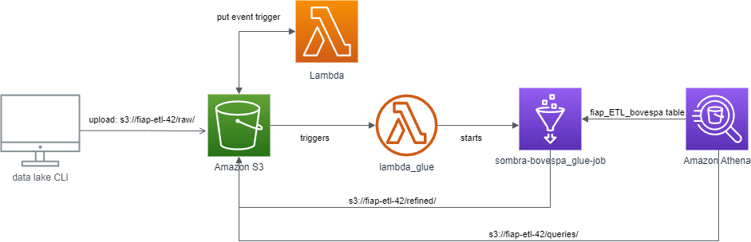

# Pipeline Batch Bovespa - Tech Challenge 2

## The Pipeline

A complete data pipeline was built to extract, process, and analyze data from B3’s trading sessions using AWS services, including S3, Glue, Lambda, and Athena. The pipeline operates in batch mode and is fully automated.

The following steps were developed:

1. Scraping the B3 website to gathertrading data with Python and Selenium Webdriver
2. Raw data are then ingested into an S3 bucket configured with PUT event trigger targetting a Lambda Function
3. The Lambda function initiates the Bovespa Batch job in AWS Glue
4. Glue Job handle all the transformation, partitioning and load into S3 bucket
5. Querying is enabled by Athena integration via Glue Data Catalog tables

## Proposed Workflow



## Virtual Env

```bash
$ python3.12 -m venv venv
$ source venv/bin/activate
$ pip install -r requirements.txt
```

## Running Local Scripts

- `$ python download.py` - Runs B3 scraping
- `$ python pipeline_util.py` - Runs simple data cleaning steps if needed
